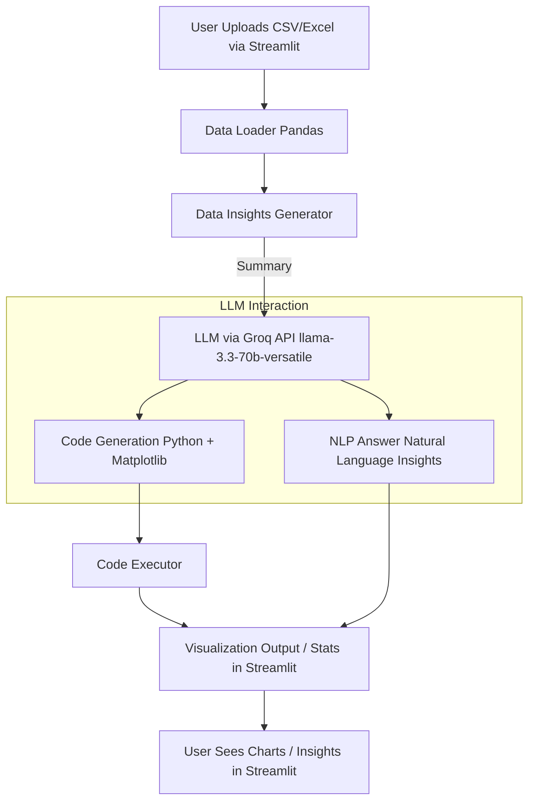

# Data Navigator: Simplify Exploration

An interactive **Streamlit web app** that simplifies data exploration using **LLMs (Groq API with LLaMA-3.3-70B-Versatile)**.
With just a dataset upload, you can **analyze, visualize, and chat with your data** — without writing a single line of code.

---

## 🚀 Features

### 📊 **Data Overview**

* Upload CSV/Excel files easily.
* Explore dataset snapshots (preview first rows).
* Get detailed insights:

  * Null values count
  * Unique values per column
  * Duplicate records
  * Descriptive statistics
  * Numeric column summary

### 📈 **Smart Visualizations**

* Generate visualizations by simply typing queries (e.g., *"Show sales by category as a bar chart"*).
* LLaMA model generates **clean Python code** (using Pandas & Matplotlib).
* Auto-execution of generated code with inline display of charts in Streamlit.

### 💬 **Chat with Data**

* Ask natural language questions about your dataset.
* LLaMA responds in **plain conversational style** (not raw stats).
* Supports comparisons, descriptive analysis, and text/NLP insights.
* If the response contains code, the app can **execute it automatically** to show results.

---

## 🧠 Powered by LLM (Groq + LLaMA-3.3-70B-Versatile)

* **Groq API** provides blazing-fast inference for LLM queries.
* Model used: **`llama-3.3-70b-versatile`**
* Two processing modes:

  1. **Code Generation** → Produces Python code for visualization/analysis.
  2. **NLP Querying** → Returns human-friendly answers without code.

---

## 🛠️ Tech Stack

* **Frontend & App** → [Streamlit](https://data-navigator-simplify-exploration.onrender.com)
* **Data Processing** → Pandas
* **Visualization** → Matplotlib
* **LLM Backend** → [Groq API](https://groq.com/) with `llama-3.3-70b-versatile`
* **Environment Management** → Python + `.env` (dotenv)

---

## ⚙️ Installation

1. **Clone the repository**

   ```bash
   git clone https://github.com/your-username/data-navigator.git
   cd data-navigator
   ```

2. **Create virtual environment & install dependencies**

   ```bash
   python -m venv venv
   source venv/bin/activate  # On Windows: venv\Scripts\activate
   pip install -r requirements.txt
   ```

3. **Set up environment variables**
   Create a `.env` file in the root directory and add your Groq API key:

   ```
   GROQ_API_KEY=your_api_key_here
   ```

4. **Run the app**

   ```bash
   streamlit run app.py
   ```

---

## 📂 Project Structure

```
data-navigator/
│── app.py                # Main Streamlit app
│── query_processor.py    # Handles LLM-powered query/code generation
│── data_insights.py      # Dataset summary & preprocessing utilities
│── code_executor.py      # Safe execution of generated code
│── requirements.txt      # Python dependencies
│── README.md             # Documentation
│── .env                  # Environment variables (API keys)
```

---

## 🏗️ Architecture

Here’s how the system works internally:



### 🔎 Flow Explanation

1. **Upload Dataset** → User provides CSV/Excel through Streamlit UI.
2. **Data Loader** → Pandas loads dataset into a DataFrame.
3. **Data Insights Generator** → Summarizes dataset (nulls, uniques, stats, etc.).
4. **Groq LLM** (`llama-3.3-70b-versatile`):

   * If query = *visualization/analysis* → Generates Python code.
   * If query = *NLP question* → Returns conversational answer.
5. **Code Executor** → Safely runs generated code (plots, stats).
6. **Streamlit UI** → Displays either chart, stats, or plain text insights back to the user.

---

## 🎯 Usage

1. Upload a **CSV/Excel** dataset.
2. Explore dataset overview in **📊 Data Overview** tab.
3. Generate visualizations by entering natural queries.
4. Switch to **💬 Chat with Data** tab to ask questions conversationally.

---

## 🔮 Future Enhancements

* Support for **SQL databases** (Postgres, MySQL).
* Integration with **advanced plotting libraries** (Seaborn, Plotly).
* Export generated **analysis reports** as PDF/Docx.
* Multi-user authentication & session management.

